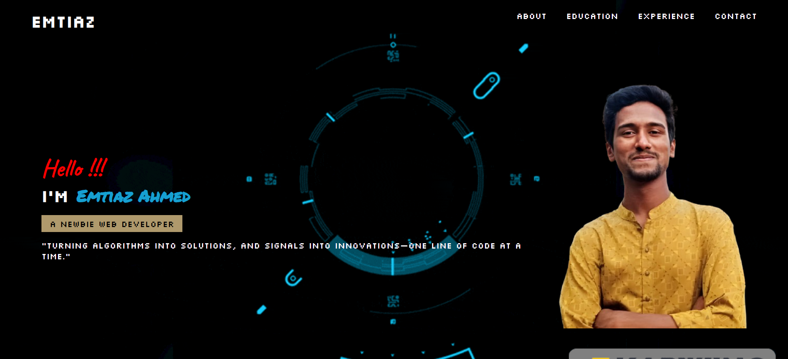

# 🚀 Personal Portfolio — Emtiaz Ahmed



## 👋 Hello, I’m **Emtiaz Ahmed**

I’m an **Information & Communication Engineering (ICE)** student at  
**Noakhali Science and Technology University (NSTU)** with strong interests in:

- 🌐 Web Development  
- 📡 Signal Processing & Networking  
- 💻 Programming & Problem Solving  

> *“Turning algorithms into solutions, and signals into innovations — one line of code at a time.”*

---

## 🔗 Live Website
👉 https://emtiazahmed01.github.io/web_programming/Personal_Portfolio/index.html

---

## 🛠️ Technologies Used

- HTML5  
- CSS3  
- Google Fonts  
- GitHub Pages  

---

## 📂 Project Structure

```
Personal_Portfolio/
│
├── home.html
├── contact.html
├── css/
│   └── style.css
├── images/
│   ├── emtiaz.png
│   └── Random_Ghost_V1.gif
└── README.md
```

---

## ✨ Features

✔ Responsive design  
✔ Modern UI  
✔ Animated background  
✔ Clean contact page  
✔ Easy to customize  

---

## 📬 Contact

- 📧 Email: emtiaz1117@student.nstu.edu.bd  
- 🌐 Website: https://emtiazahmed01.github.io  
- 🏫 Dept. of ICE, NSTU  
